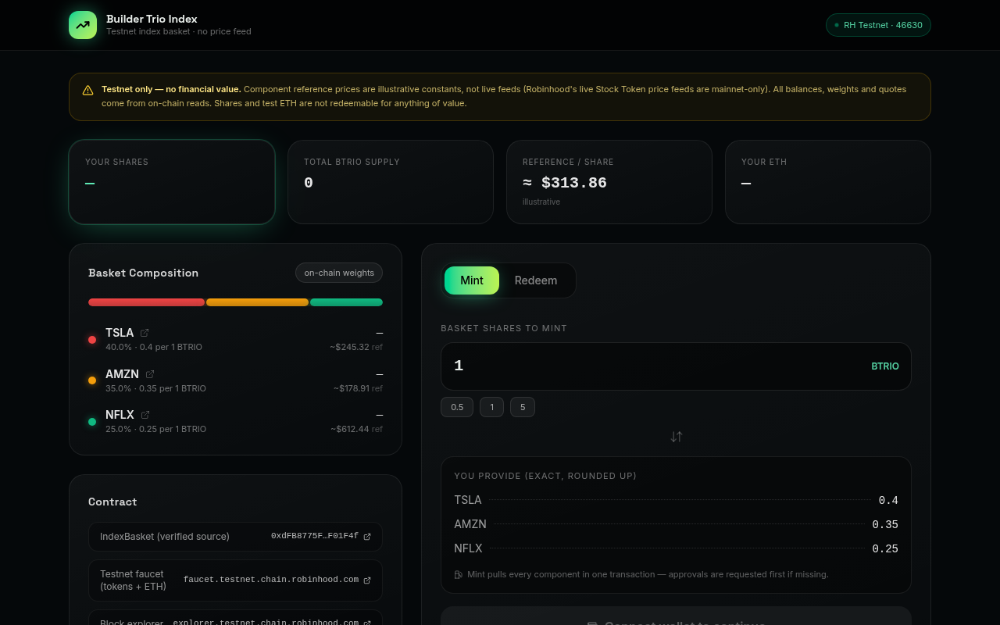
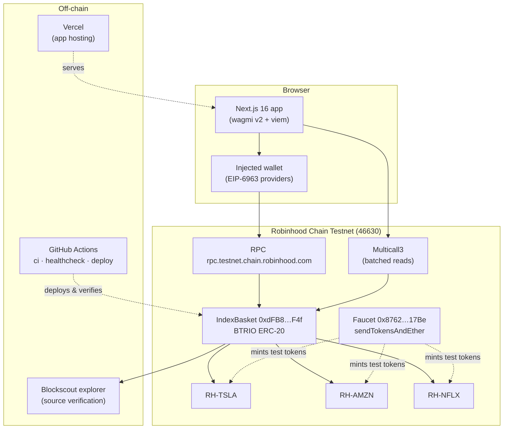

<div align="center">

# Builder Trio Index — `BTRIO`

**A minimal, honest index basket over real Robinhood Chain Testnet Stock Tokens**

Deposit weighted TSLA + AMZN + NFLX tokens → mint basket shares. Burn shares → get the components back.
No price oracle, no vault strategy, no promises — just composition you can verify on-chain.

[](https://github.com/0o0r7/IndexBasket/actions/workflows/ci.yml)
[](https://github.com/0o0r7/IndexBasket/actions/workflows/healthcheck.yml)
[](https://github.com/0o0r7/IndexBasket/actions/workflows/deploy.yml)
[](LICENSE)


**[Live App](https://builder-trio-index.vercel.app)** · **[Health Dashboard](https://builder-trio-index.vercel.app/health)** · **[Verified Contract](https://explorer.testnet.chain.robinhood.com/address/0xdFB8775FF189254bCa8E328bea60d261DDF01F4f)** · [Report a Bug](.github/ISSUE_TEMPLATE/bug_report.md)



</div>

---

## Table of contents

- [Why this design](#why-this-design)
- [Architecture](#architecture)
- [Live deployment record](#live-deployment-record)
- [Repository structure](#repository-structure)
- [Quickstart](#quickstart)
- [Testing](#testing)
- [Deploying & verifying](#deploying--verifying)
- [Health & troubleshooting](#health--troubleshooting)
- [Security model](#security-model)
- [Verify everything yourself](#verify-everything-yourself)
- [Project status & roadmap](#project-status--roadmap)
- [Contributing, security & license](#contributing-security--license)

## Why this design

Robinhood Chain's live Chainlink **Stock Token price feeds are mainnet-only**. Most testnet
projects work around that by faking a feed — this project refuses to. Instead, the contract
tracks **composition, not price**: every share is a claim on a fixed quantity of underlying
tokens (`0.4 TSLA + 0.35 AMZN + 0.25 NFLX` per 1.0 share). Minting requires depositing exactly
that weighted amount; redeeming returns it.

The result is a protocol whose every public claim is checkable against its own state:

- There is no oracle to go stale, no TWAP to manipulate, no valuation function to dispute.
- The frontend's dollar figures are labeled **illustrative reference data** — the only
  numbers the contract itself trusts are token quantities it holds.
- The economics are deliberately boring: two state-changing flows (`mint`, `redeem`), one
  one-time setup (`setComponents`), and nothing else. On testnet, that is the honest scope.

## Architecture



**Contract design** (see [docs/architecture.md](docs/architecture.md) for the full spec):

| Property | Behavior |
|---|---|
| Mint | `amount = ceil(unitsPerShare × shares / 1e18)` per component — rounds **in the basket's favor**, so it can never be under-collateralized |
| Redeem | `amount = floor(unitsPerShare × shares / 1e18)` — rounding dust stays in the basket |
| Setup | `setComponents` is one-time and owner-gated; it is called **before** ownership transfer so the basket can never be bricked by losing keys |
| Reentrancy | `ReentrancyGuard` on both flows + `SafeERC20` transfers |
| Errors | Custom errors (`AlreadyInitialized`, `ZeroShares`, `LengthMismatch`, …) — cheap and precise |
| Pricing | None. The contract never reads a price feed. |

## Live deployment record

Produced by the CI pipeline (`.github/workflows/deploy.yml`, run history in the Actions tab)
and independently re-verified against the RPC and explorer. The machine-readable record lives
in [`deployments/testnet.json`](deployments/testnet.json).

| Artifact | Value |
|---|---|
| **Basket contract** (source verified) | [`0xdFB8775FF189254bCa8E328bea60d261DDF01F4f`](https://explorer.testnet.chain.robinhood.com/address/0xdFB8775FF189254bCa8E328bea60d261DDF01F4f) |
| Deploy tx | [`0xd3c715a1…8f3d80de8`](https://explorer.testnet.chain.robinhood.com/tx/0xd3c715a1b9e04c1e67cf184a7fa7a3139720f6b104cfeceb588a29e8f3d80de8) (block 124774758) |
| `setComponents` tx | [`0xb914c627…0adf1f7d`](https://explorer.testnet.chain.robinhood.com/tx/0xb914c62769426643ad76e57fd7f95ec83855d04f1cd8765b475a22bd0adf1f7d) |
| `transferOwnership` tx | [`0xcabbd4b2…232e3a4cf`](https://explorer.testnet.chain.robinhood.com/tx/0xcabbd4b2535524dd42d375a956ab6963a178fd3953cea509f031088232e3a4cf) |
| On-chain `owner()` | `0xd57bC3482F32acFD5B52efb723288376aE1b2Fd2` — the deployment burner retains no privileges |
| Frontend | [builder-trio-index.vercel.app](https://builder-trio-index.vercel.app) |

**Component tokens** — faucet-confirmed testnet Stock Tokens (18 decimals), locked from
on-chain faucet distributions, not copied from any registry:

| Token | Address | Weight | Units / 1.0 share |
|---|---|---|---|
| RH-TSLA | [`0xC9f9…Bd4E`](https://explorer.testnet.chain.robinhood.com/address/0xC9f9c86933092BbbfFF3CCb4b105A4A94bf3Bd4E) | 40% | 0.4 (`4e17` raw) |
| RH-AMZN | [`0x5884…09E02`](https://explorer.testnet.chain.robinhood.com/address/0x5884aD2f920c162CFBbACc88C9C51AA75eC09E02) | 35% | 0.35 (`3.5e17` raw) |
| RH-NFLX | [`0x3b82…8C93`](https://explorer.testnet.chain.robinhood.com/address/0x3b8262A63d25f0477c4DDE23F83cfe22Cb768C93) | 25% | 0.25 (`2.5e17` raw) |

> ⚠️ **Counterfeit warning:** the testnet contains same-ticker clones ("TSLA Test Stock",
> "Edel TSLA", "Aave Stock TSLA", …). **A matching ticker does not identify a Robinhood
> Stock Token.** The addresses above were traced from the official faucet contract's
> ([`0x8762…17Be`](https://explorer.testnet.chain.robinhood.com/address/0x8762F93772c663c6a88Ba50900bd5381df2717Be))
> on-chain distributions.

| Network | Value |
|---|---|
| Chain ID | `46630` (`0xb626`) |
| RPC | `https://rpc.testnet.chain.robinhood.com` |
| Explorer | `https://explorer.testnet.chain.robinhood.com` |
| Faucet | `https://faucet.testnet.chain.robinhood.com` |

## Repository structure

```
IndexBasket/
├── contracts/
│   ├── IndexBasket.sol        # The basket (ERC-20 shares, mint/redeem, one-time setup)
│   └── mocks/                 # Test-only tokens (incl. a reentrancy attacker)
├── test/
│   └── IndexBasket.test.js    # 25-case Hardhat suite
├── scripts/
│   ├── deploy.js              # Deploy → setComponents → transferOwnership → record
│   └── verify-args.js         # Constructor args for explorer verification
├── deployments/
│   └── testnet.json           # Machine-readable, written by the deploy run itself
├── frontend/
│   ├── app/                   # Next.js 16 app (incl. /health troubleshooter page)
│   ├── components/            # UI: wallet button, composition card, action panel, activity log
│   ├── lib/                   # wagmi config, chain defs, contract bindings, wallet hook
│   ├── scripts/               # sync-deployments.mjs · healthcheck.mjs (CLI)
│   └── e2e/                   # Playwright connect-flow suite (simulated EIP-1193 provider)
├── .github/
│   ├── workflows/             # ci.yml · healthcheck.yml · deploy.yml
│   ├── ISSUE_TEMPLATE/        # bug report + feature request
│   └── dependabot.yml         # npm + actions bumps, weekly
├── docs/
│   ├── architecture.md        # Contract spec, invariants, frontend data flow
│   ├── verification.md        # Independent verification runbook (every claim → link/command)
│   └── screenshots/
├── hardhat.config.js          # Robinhood testnet network + Blockscout verification
└── deployments/testnet.json   # (see above)
```

## Quickstart

**Prerequisites:** Node.js ≥ 20, npm ≥ 10.

### 1. Contract workspace

```bash
git clone https://github.com/0o0r7/IndexBasket.git
cd IndexBasket
npm install

npx hardhat compile   # Solidity ^0.8.20, OpenZeppelin Contracts v5
npx hardhat test      # 25/25 tests should pass
```

### 2. Frontend

```bash
cd frontend
npm install
npm run dev           # http://localhost:3000
```

The app resolves the basket address from `NEXT_PUBLIC_BASKET_ADDRESS` (optional) or the
bundled `deployments/testnet.json` snapshot, which is re-synced automatically before every
`dev`/`build` run. No environment variables are required to run read-only.

Connect any EIP-1193 injected wallet (MetaMask, etc.), add the Robinhood Testnet network
(the app offers the switch/add prompt for you), claim test tokens from the
[faucet](https://faucet.testnet.chain.robinhood.com), and mint.

## Testing

25 cases across the full lifecycle — composition setup, mint math, redeem math, access
control, and failure modes:

| Area | What is asserted |
|---|---|
| `setComponents` | One-time enforcement (double init reverts), length mismatch, empty list, weights stored exactly |
| Mint | Exact deposit amounts for round lots, **ceil rounding literals** (`…000000000000000001n`), share minting, event payloads |
| Redeem | Proportional payouts, **floor rounding** (dust stays in basket), over-balance burn rejection |
| Security | Reentrancy blocked on `mint` and `redeem` (malicious tokens), non-owner cannot re-initialize |
| ERC-20 | Transfers, approvals, supply accounting of BTRIO itself |

Run the E2E suite (headless Chromium with a **simulated** EIP-1193 provider — standard
dApp-testing technique, clearly labeled as such):

```bash
cd frontend
npm i -D playwright && npx playwright install chromium
npm run build && npm run start &    # or: npm run dev
node e2e/connect.mjs
```

## Deploying & verifying

The canonical path is the **CI pipeline** (`.github/workflows/deploy.yml`, manual trigger) —
it compiles, runs the full test suite, deploys, sets components, transfers ownership, verifies
the source on the Blockscout explorer, and commits the resulting `deployments/testnet.json`.
Credentials enter the runner only as GitHub Environment secrets and are never printed or stored.

To deploy from your own machine instead:

```bash
cp .env.example .env            # then fill in a TESTNET burner key — never a mainnet key
npm install
npx hardhat run scripts/deploy.js --network robinhoodTestnet
npx hardhat verify --network robinhoodTestnet <ADDRESS> --constructor-args scripts/verify-args.js
```

`scripts/deploy.js` refuses to run with a malformed key/address, wrong chain ID, or low gas
balance — and it transfers ownership to `MAINWALLET_ADD` **after** `setComponents`, then
re-reads `owner()` on-chain to confirm the handover before writing the deployment record.

## Health & troubleshooting

Three layers, all green in the badges above:

1. **In-app troubleshooter** — [`builder-trio-index.vercel.app/health`](https://builder-trio-index.vercel.app/health)
   runs 11 live checks from *your* browser: RPC reachability, explorer API, contract bytecode,
   name/symbol/supply, components vs. the recorded snapshot, decimals, owner, address source,
   and a raw EIP-1193 wallet connect drill (including the
   `wallet_switchEthereumChain` → `wallet_addEthereumChain` fallback).
2. **CLI healthcheck** — `node frontend/scripts/healthcheck.mjs` runs 9 checks against the
   live site and chain; the same script gates every push in CI (daily schedule included).
3. **PR/push CI** — `.github/workflows/ci.yml` compiles and runs all 25 tests, and builds the
   frontend on every change.

Common issues: wallet connected but wrong network → use the in-app switch prompt; no tokens →
faucet claims 5.0 of each per call; explorer page looks empty → Blockscout indexing lag, retry
in a minute (the healthcheck automates exactly these probes).

## Security model

- **One-time initialization** — `setComponents` reverts on any second call; a compromised
  owner cannot alter composition after setup.
- **Rounding always favors the basket** — ceil on mint, floor on redeem; the contract can
  never owe more than it holds.
- **Reentrancy hardened** — guard on both flows, `SafeERC20` everywhere, state mutated
  before external transfers on redeem.
- **Ownership handover verified on-chain** — the deploy script fails loudly if `owner()`
  does not equal the intended final owner.
- **No keys in the repo, ever** — `.env` is gitignored, CI secrets are environment-scoped,
  the deployment burner retains no privileges after transfer.
- **Testnet-only by design** — BTRIO and faucet tokens have zero monetary value; see
  [`SECURITY.md`](SECURITY.md) before disclosing anything.

## Verify everything yourself

Every number in this README traces to an on-chain artifact or a CI log —
[docs/verification.md](docs/verification.md) is the full runbook of explorer links and
one-liner commands (RPC `eth_call`s, Blockscout API queries) to reproduce each claim
independently, including how the component addresses were forensically traced to the faucet.

## Project status & roadmap

**Status: v1.0.0 — deployed, verified, and monitored on Robinhood Chain Testnet.**

Done: 25/25 unit tests · CI deploy pipeline · source-verified contract · fresh Next.js
frontend with real connect flow · in-app + CLI + scheduled healthchecks · production hosting.

Honest non-goals (deliberate): no price oracle, no swap/trading features, no mainnet
deployment. Chainlink Stock Token feeds are mainnet-only; rather than fake one, this project
scopes itself to verifiable composition. If mainnet feeds become available to testnet, an
optional *read-only* valuation display is the natural next step — contributions welcome via
[CONTRIBUTING.md](CONTRIBUTING.md).

## Contributing, security & license

- **Contributing** — [CONTRIBUTING.md](CONTRIBUTING.md) (setup, conventions, PR checklist)
- **Security** — [SECURITY.md](SECURITY.md) for scope and responsible disclosure
- **Changelog** — [CHANGELOG.md](CHANGELOG.md)
- **Code of conduct** — [CODE_OF_CONDUCT.md](CODE_OF_CONDUCT.md)
- **License** — [MIT](LICENSE)

---

<div align="center">

**Disclaimer:** This is an engineering demonstration on a testnet. It is **not** investment
advice, **not** a Robinhood product, and **not affiliated with or endorsed by Robinhood
Markets, Inc.** BTRIO shares and testnet Stock Tokens have no monetary value.

</div>
